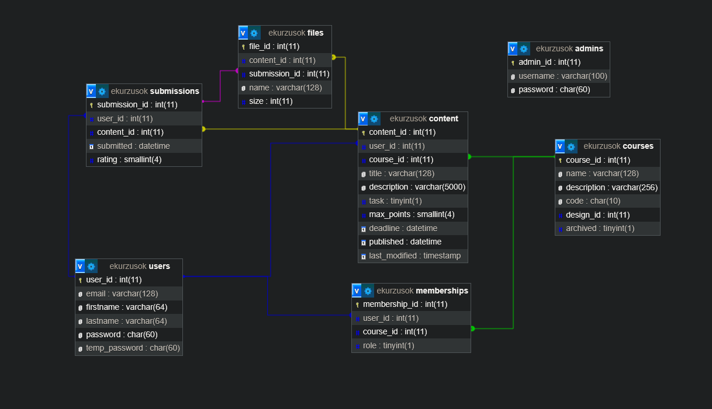

# ekurzusok
Technikusi vizsga 2024-2025 \
A projekt résztvevői: Ferenczy Bálint, Iványi Anna, Vizler Dávid

## TODO
**Frontend**
- [ ] Saját, csatlakozott és archivált kurzusok egyértelmű elkülönítése
- [x] Üres kurzusok oldal kidekorálása
- [x] Kurzus módosításának letiltása tanároknál, akik nem tulajdonosok
- [x] Közzétett-nem közzétett tartalom betöltési glitch javítása
- [x] Közzétett-nem közzétett tartalom ne jelenjen meg diákoknál
- [x] Regisztráció ellenőrzés visszajelzés
- [x] Kurzus visszaállítása archivált állapotból
- [x] Jogosultságkezelés
- [x] Több fájl feltöltése a meglévők mellé
- [x] Közzlétett, nem közzétett tartalom oldal átrendezése
- [x] Feladatleadás (ne tudja mégegyszer leadni a felhasználó)
- [x] Kurzus törlése
- [x] Felhasználó kilépése a kurzusból (önmagától)
- [x] Frontend javítások (görgethetőség, reszponzivtás)
- [x] Csatolt fájl nélkül beküldött megoldások megjelenítése
- [x] Maradjon bejelentkezve gomb
- [x] Beadott munkák megtekintése
- [x] Felhasználó tanári státuszának módosítása a kurzusban
- [x] Beadandóhoz feltöltött fájlok lekérdezése
- [x] Feltöltött fájlok törlése
- [x] Tartalomhoz feltöltött fájlok lekérdezése
- [x] Leadott munkák megtekintése
- [x] Kilépés gomb ne jelenjen meg a felhasználó saját kurzusában
- [x] Leadás értékelése, A beadandóhoz tartozó adatok lekérdezésénél az értékelés pontja és a max pont is legyen ott

**Backend**
- [x] Fájl letöltés jogosultságkezelés
- [x] Felhasználó fiók törlése
- [x] Műveletek letiltása az archivált kurzusokban

**Admin felület**
- [x] Felhasználó új jelszó generálás
- [x] Felhasználó jelszó módosítás vagy visszaállítás
- [x] Keresés

**Mindkettő**
- [x] Felhasználó új jelszó igénylés
- [x] Feladaton belül a felhasználó-e a feladat készítője (fel tud-e tölteni beadandókat vagy meg tudja tekinteni a beküldött beadandókat)
- [x] Kurzuson belül a felhasználó tanár-e (jelenleg csak azt vizsgálja, hogy tulajdonos-e)
- [x] Kurzus csatlakozási kód lekérése és megjelenítése
- [x] Annak lekérése, hogy a felhasználó már leadta-e az adott feladatot

**Egyéb**
- [ ] Dokumentáció befejezése
- [x] Adatgenerátor ne generálja le ugyanazt az e-mail címet többször + adatbázis frissítése
- [x] Projekt beadható és tesztelhető formában

## Jogosultságok


## Fájlfeltöltéshez szükséges teendők
**php.ini**-ben pár paramétert át kell állítani.\
A fájl itt található Windows-on: `C:\xampp\php\php.ini`
```
file_uploads = On
upload_max_filesize = 30M
max_file_uploads = 10
post_max_size = 300M
```

## Dokumentáció
A részletes dokumentáció elérhető [ezen a linken](https://docs.google.com/document/d/1uhBqkqfKAe0qxYCk307rlWE4jrNmFYU45DSQCpYt-Fk/edit?usp=sharing). 

## PHP struktúra és API
Minden adatbázisshoz köthető, adatváltoztató és lekérdező művelet az api-n keresztül érhető el, POST metódussal. A műveletek megadása végpontok segítségével történnek (pl. `api/user/login`).

A műveletek és lekérdezések megadások és a hozzájuk tartozó várt/visszatérő adatok megtalálhatóak [ebben a segédletben](https://docs.google.com/spreadsheets/d/1QqVU3NuwNTp1Xk_SZ8jrgYIF6DXR1OvF8vQTprfVUaY/edit?usp=sharing), ahol a végpontok állapota is nyilván van tartva.

## Fájlok letöltése
A letöltendő fájlok esetén az alábbi linket kell megnyitni a megfelelő értékkel behelyettesítve:

`downloader?file_id=x&attached_to=y&id=z`

A `file_id` a fájl ID-ja, az `attached_to` azt jelenti, hogy mihez van csatolva a fájl: ha tartalomhoz, akkor ennek az értéke `content`, ha beadandóhoz, akkor `submission`. Az `id` a tartalom vagy beadandó ID-ját jelöli.

## Új jelszó igénylése
A felhasználó képes egy új ideiglenes jelszót igényelni, ha elfelejtette jelszavát. Az ideiglenes jelszóval csak a bejelentkezés és a jelszóváltoztatás funkciók működnek. A régi jelszó továbbra is működőképes marad. Régi jelszóval való bejelntkezés vagy jelszóváltoztatás esetén az ideiglenes jelszó törlődik az adatbázisból.

## Adatbázis


A db mappában megtalálható az `ekurzusok_ures.sql`, ami az üres adatbázis és az `ekurzusok_tesztadatokkal.sql`, ami tartalmaz 12.754 felhasználót, 4718 kurzust, 138.174 tagságot és egy admin fiókot.

Az adatgenerátor a `DataGenerator.zip` fájlban található. Kicsomagolás után a mappán belül a `dotnet run` paranccsal lehet futtatni. A program 3 CSV fájlt generál: `user.csv`, `courses.csv` és `memberships.csv`, amelyeket be lehet importálni az **üres** SQL adatbázisba. Visual Studio-ból futtatva a `DataGenerator\bin\Debug\net8.0` mappába teszi a fájlokat, parancssorból futtatva közvetlenül a `DataGenerator` gyökérkönyvtárba. **Importáláskor be kell állítani phpmyAdmin-ban, hogy az első sort (fejlécet) hagyja ki és hogy az elválsztó karakter pontosvessző legyen!**

A tesztelés leegyszerűsítése érdekében az összes felhasználó jelszava, beleértve az adminisztrátorokat, a tesztadatokat tartalmazó adatbázisban "Almafa123".

## Tesztek
A tesztek futtatása előtt a szükséges csomagokat le kell tölteni és meg kell adni a megfelelő adatoktat.
1. Lépjen be a [test](test/) mappába: `cd test`
2. Töltse le a szükséges csomagokat: `npm install`
3. A [config.js](test/config.js) fájlban állítsa be a weboldal URL címét és a tesztekhez használt fiók email címét és jelszavát

A tesztek futtatásához az alábbi parancsot kell futtatni: `npm test`
